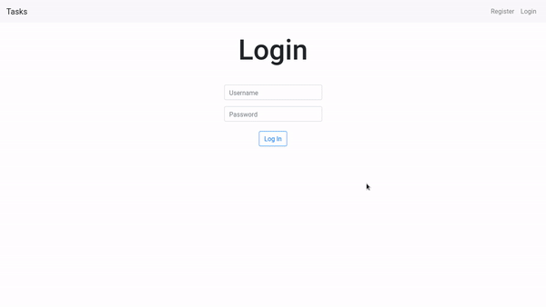

     
    
     

 

# CS50 - Introduction to computer science

 

These are the programs that i made on the CS50 - Introduction to computer science course. The programs use C, and Python to recover lost files, edit images and manage a database in a .csv file and create a dictionary. 

In this course i also learn to use Flask to create a website with Python, and in the final project i use Flask to create an website. The website has the login, search and store functionalities.
